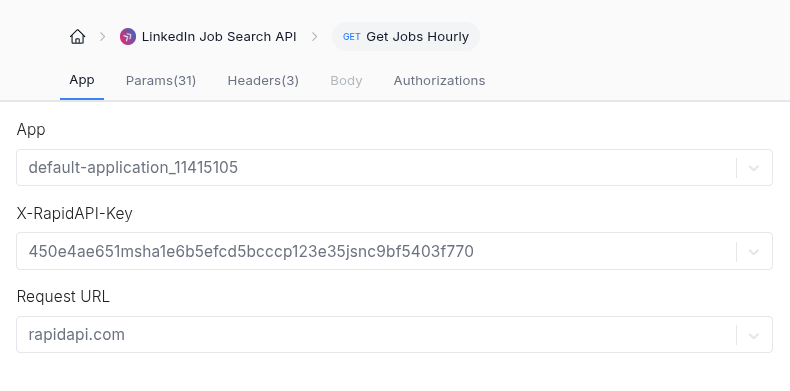

[Status Badge](https://img.shields.io/badge/STATUS-Developing-blue)
## :dart: Project Goal 
  
This is a tool meant to scan the job market for a candidate resume and provide them with a Market Fit Analysis in quantity and quality. Helping them spot **how their main skills, techs and tools** currently relate to the market requirements, which can they improve and which are they currently most compliant with. 

## :thinking:  What questions can this analysis answer?

- What percentage of the current open positions for my career am I potentially missing due to lacking some requirements?
- What are my most popular skills? Where am I doing great?
- What skills am I missing the most?
- Can I have a table of open positions and for each one get which requirements I'm compliant with and which ones I'm missing or haven't made its relevance explicit enough in my resume? (Yes!)
- Can I get a comparison for soft skills as well as hard skill? (Yes!)

## :newspaper: Data Sources and Keys
Because most job source APIs are not free and this is not a production grade project so far, its use requires keys to be provided by the user and it is as limited as their own implicit limitations. Required keys are:  
- :key: [LinkedIn Job Search API Key](https://rapidapi.com/fantastic-jobs-fantastic-jobs-default/api/linkedin-job-search-api/playground/apiendpoint_259c91ee-a922-4e24-8d2c-105272a7024a) (provide the X-RapidAPI-Key as seen)

- :key: LLM API Key (Gemini)

## Frontend Example
:construction: Under construction...